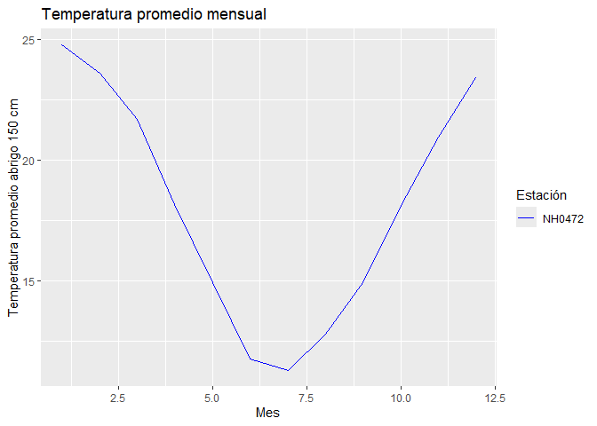
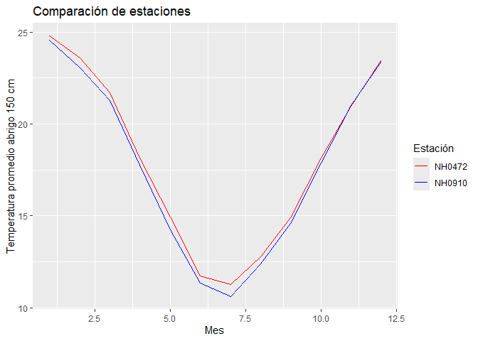

<!-- README.md is generated from README.Rmd. Please edit that file -->

# EstacionesMeteorologicas

<!-- badges: start -->

[](https://lifecycle.r-lib.org/articles/stages.html#experimental)
[](https://app.codecov.io/gh/InesGaldeano/EstacionesMeteorologicas)

[](https://github.com/InesGaldeano/EstacionesMeteorologicas/actions/workflows/R-CMD-check.yaml)
<!-- badges: end -->

El objetivo de este paquete es analizar datos de estaciones
meteorologicas, resumiendo y presentadolos.

## Instalación

Podes instalar el paquete en [GitHub](https://github.com/) con:

``` r
# install.packages("pak")
pak::pak("InesGaldeano/EstacionesMeteorologicas")
```

## Carga paquete

Se debe cargar el paquete con el siguente código.

``` r
library(EstacionesMeteorologicas)
```

## Funciones principales

El paquete incluye tres funciones principales:

descargar_leer_estaciones() Descarga y lee los datos meteorológicos de
una estación específica del INTA.

``` r
 estacion1 <- descargar_leer_estaciones("NH0472", "../estacionNH0472.csv")
#> ✔ El archivo ya existía en ../estacionNH0472.csv.
#> ℹ Leyendo datos de la estación NH0472
#> Rows: 20425 Columns: 35
#> ── Column specification ────────────────────────────────────────────────────────
#> Delimiter: ","
#> chr   (1): id
#> dbl  (18): temperatura_abrigo_150cm, temperatura_abrigo_150cm_maxima, temper...
#> lgl  (15): temperatura_suelo_5cm_media, temperatura_suelo_10cm_media, temper...
#> date  (1): fecha
#> 
#> ℹ Use `spec()` to retrieve the full column specification for this data.
#> ℹ Specify the column types or set `show_col_types = FALSE` to quiet this message.
```

tabla_resumen_temperatura() Crea una tabla resumen con estadísticas
básicas de temperatura (promedio, desvío, máximos y mínimos).

``` r
tabla_resumen_temperatura(estacion1)
#> # A tibble: 1 × 5
#>   id     promedio_temperatura desvio_estandar temp_max temp_min
#>   <chr>                 <dbl>           <dbl>    <dbl>    <dbl>
#> 1 NH0472                 18.0            5.94     42.1       -8
```

grafico_temperatura_mensual() Genera un gráfico de líneas con la
temperatura promedio mensual de una o varias estaciones.

``` r
grafico_temperatura_mensual(estacion1, c("blue"), "Temperatura promedio mensual")
```



## Ejemplo de uso completo

**Descargar datos de varias estaciones**

``` r
est1 <- descargar_leer_estaciones("NH0472", "../estacionNH0472.csv") 
#> ✔ El archivo ya existía en ../estacionNH0472.csv.
#> ℹ Leyendo datos de la estación NH0472
#> Rows: 20425 Columns: 35
#> ── Column specification ────────────────────────────────────────────────────────
#> Delimiter: ","
#> chr   (1): id
#> dbl  (18): temperatura_abrigo_150cm, temperatura_abrigo_150cm_maxima, temper...
#> lgl  (15): temperatura_suelo_5cm_media, temperatura_suelo_10cm_media, temper...
#> date  (1): fecha
#> 
#> ℹ Use `spec()` to retrieve the full column specification for this data.
#> ℹ Specify the column types or set `show_col_types = FALSE` to quiet this message.
est2 <- descargar_leer_estaciones("NH0910", "../estacionNH0910.csv")
#> ✔ El archivo ya existía en ../estacionNH0910.csv.
#> ℹ Leyendo datos de la estación NH0910
#> Rows: 15553 Columns: 35
#> ── Column specification ────────────────────────────────────────────────────────
#> Delimiter: ","
#> chr   (1): id
#> dbl   (5): temperatura_abrigo_150cm, temperatura_abrigo_150cm_maxima, temper...
#> lgl  (28): temperatura_intemperie_5cm_minima, temperatura_intemperie_50cm_mi...
#> date  (1): fecha
#> 
#> ℹ Use `spec()` to retrieve the full column specification for this data.
#> ℹ Specify the column types or set `show_col_types = FALSE` to quiet this message.
```

**Combinar y resumir**

``` r
todas <- dplyr::bind_rows(est1, est2)
tabla_resumen_temperatura(todas)
#> # A tibble: 2 × 5
#>   id     promedio_temperatura desvio_estandar temp_max temp_min
#>   <chr>                 <dbl>           <dbl>    <dbl>    <dbl>
#> 1 NH0472                 18.0            5.94     42.1     -8  
#> 2 NH0910                 17.7            6.12     43       -8.5
```

**Graficar**

``` r
grafico_temperatura_mensual(todas, c("red", "blue"), "Comparación de estaciones")
```



## Créditos

Datos meteorológicos obtenidos del Instituto Nacional de Tecnología
Agropecuaria (INTA) – Sistema de Información y Gestión Agropecuaria
(SIGA).

## Licencia

Este paquete se distribuye bajo la licencia [MIT](LICENSE.md).

## Cómo contribuir

Si querés proponer cambios o mejoras, consultá la [guía para
contribuir](.github/CONTRIBUTING.md)  
y leé el [Código de Conducta](CODE_OF_CONDUCT.md).

# Autores del paquete: Inés Galdeano y Maite Gómez Garín.

## 
